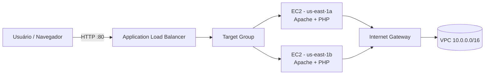
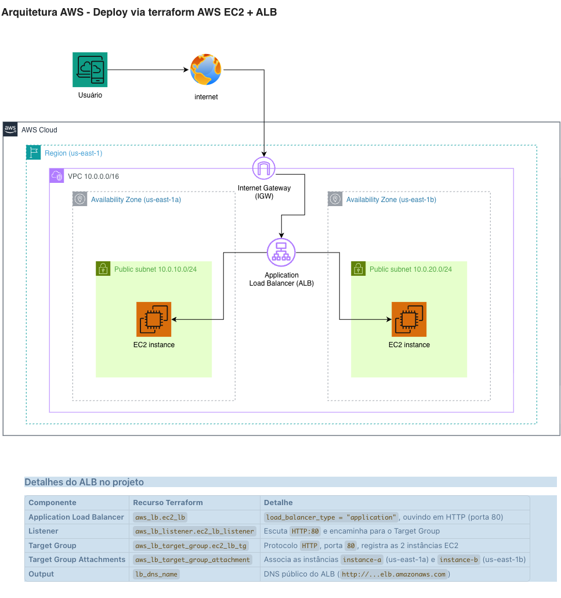

# Terraform com AWS: EC2 + Application Load Balancer (ALB)

>  Projeto avaliativo da disciplina **Arquitetura Compute e Storage** do Professor Ricardo Marega Morschbacher da FIAP MBA.
>  Cria, de forma **100% automatizada**, uma infraestrutura na AWS com **2 servidores EC2** atrás de um **Application Load Balancer (ALB)**, usando **Terraform** e **GitHub Actions**.

>  Alunos
> - Bruno Pinheiro dos Santos
> - Anderson Peruci
> - Renan José da Silva
> - Gustavo Santos de Andrade


O deploy inteiro é feito pelo **GitHub Actions**: você só precisa de um repositório no GitHub, das chaves de acesso da AWS e apertar um botão. 

---

## O que este projeto cria?

Tudo é criado automaticamente na região **`us-east-1`**:

| Recurso                             | O que é (para quem está começando)                                | Quantidade |
| ----------------------------------- | ----------------------------------------------------------------- | ---------- |
| **VPC**                             | A "rede privada" da sua infraestrutura                            | 1          |
| **Subnets públicas**                | Divisões da rede onde os servidores ficam                         | 2          |
| **Internet Gateway**                | "Porta" de entrada/saída para a internet                          | 1          |
| **Route Table**                     | Tabela que envia o tráfego externo pelo Internet Gateway          | 1          |
| **Security Group**                  | "Firewall" que libera as portas 22 (SSH), 80 (HTTP) e ICMP (ping) | 1          |
| **EC2 (instâncias)**                | Servidores virtuais — Amazon Linux 2023, `t2.micro`               | 2          |
| **Target Group**                    | Lista dos servidores que o balanceador pode usar                  | 1          |
| **Application Load Balancer (ALB)** | Distribui o tráfego HTTP entre os 2 servidores                    | 1          |
| **Listener (HTTP:80)**              | "Porta de entrada" do balanceador                                 | 1          |

Ao acessar o endereço (DNS) do balanceador, ele **alterna o tráfego entre os 2 EC2** — você vê isso acontecendo ao atualizar a página.





---

## Conceitos básicos (glossário rápido)

- **AWS** — A nuvem da Amazon. Este projeto usa a região **`us-east-1`**.
- **EC2** — Servidores virtuais ("máquinas") na nuvem.
- **ALB (Application Load Balancer)** — Distribui o tráfego HTTP entre vários servidores.
- **VPC / Subnet** — A rede privada e as suas subdivisões (uma por Zona de Disponibilidade).
- **Security Group** — Regras de firewall: quais portas aceitam conexão.
- **Terraform** — Ferramenta de **"Infraestrutura como Código"**: você escreve o que quer criar e ele cria/remove automaticamente. O código fica em `terraform/`.
- **GitHub Actions** — Serviço do GitHub que executa comandos automaticamente a cada `push` (ou manualmente). É ele quem roda o Terraform por você.
- **IAM** — Serviço de permissões da AWS. Usamos um usuário IAM com chaves de acesso para o Terraform "falar" com a AWS.
- **S3** — Armazenamento de arquivos. Aqui guardamos o **state** do Terraform.
- **Backend S3** — Onde o Terraform salva o estado da infraestrutura (`terraform.tfstate`), configurado em `terraform/provider.tf`.

---

## Pré-requisitos (passo a passo)

### 1. Conta AWS

- Crie uma conta em <https://aws.amazon.com/> (o programa **AWS Educate** ou **Learner Lab** também funciona para labs).

### 2. Bucket S3 para o estado do Terraform

O Terraform guarda o "estado" da infraestrutura em um bucket S3. O código já espera um bucket com nome específico:

1. Console AWS → **S3** → **Create bucket**.
2. Nome do bucket: **`tf-s3-grupo-abgr`** (exatamente este nome).
3. Região: **`us-east-1`**.
4. (Recomendado) Ative **Bucket Versioning** — permite recuperar o estado se algo der errado.
5. **Create bucket**.

> Esse nome está definido em `terraform/provider.tf`. Se você usar outro nome, o deploy falhará — ou edite o arquivo para o nome que você criou.

### 3. Usuário IAM + chaves de acesso (Access Keys)

O Terraform precisa de "credenciais" para criar recursos na AWS:

1. Console AWS → **IAM** → **Users** → **Create user** (ex.: `terraform-ci`).
2. Na etapa de permissões, escolha **"Attach policies directly"** e marque:
   - `AmazonEC2FullAccess` (já inclui EC2, VPC e ELB);
   - `AmazonS3FullAccess` (para ler/gravar o state e o arquivo de lock).
   - 💡 Para simplificar no lab, muitos alunos usam `AdministratorAccess`. Para produção, prefira políticas restritas.
3. Crie o usuário e, na aba **Security credentials**, clique em **Create access key**.
4. **Copie e guarde** o `Access Key ID` e o `Secret Access Key` — a AWS só mostra essa tela **uma vez**.

### 4. Repositório no GitHub

1. Crie um repositório no GitHub (ou use este projeto).
2. Faça o `push` do código. Os pipelines já vêm configurados em `.github/workflows/terraform-deploy.yml` (deploy) e `.github/workflows/terraform-destroy.yml` (destroy).

### 5. Segredos do GitHub (GitHub Secrets)

As chaves da AWS **não podem ficar escritas no código**. Elas ficam guardadas como _secrets_ do GitHub:

1. No repositório → **Settings** → **Secrets and variables** → **Actions**.
2. Clique em **New repository secret** e adicione:
   - `ACCESS_KEY_ID` → seu Access Key ID
   - `SECRET_ACCESS_KEY` → seu Secret Access Key

> Nunca cole essas chaves em arquivos do repositório! O `.gitignore` já protege o projeto contra isso.

### 6. (Opcional) Terraform instalado localmente

Só precisa se quiser rodar na sua própria máquina (Forma B): <https://developer.hashicorp.com/terraform/tutorials/cli/install>.

---

## FORMA A (RECOMENDADA): Deploy pelo GitHub Actions

Tudo é automático — o GitHub roda o Terraform para você.

### Passo 1 — Dispare o workflow

1. Abra o repositório → aba **Actions**.
2. No menu lateral, clique em **"Terraform AWS EC2 + ALB Deploy"**.
3. Clique em **Run workflow** → selecione a branch `main` → **Run workflow**.

### Passo 2 — Acompanhe a execução

O job `terraform-apply` executa estas etapas, em ordem:

| Etapa                            | O que faz                                              |
| -------------------------------- | ------------------------------------------------------ |
| 1. **Checkout**                  | Copia o código do repositório para a máquina do GitHub |
| 2. **Install Terraform**         | Instala o **Terraform 1.10.5**                         |
| 3. **Configure AWS Credentials** | Lê os _secrets_ e "loga" na AWS                        |
| 4. **Terraform Init**            | Baixa o provider AWS e conecta no backend S3           |
| 5. **Terraform Validate**        | Confere se o código está correto                       |
| 6. **Terraform Format Check**    | Confere a formatação do código                         |
| 7. **Terraform Plan**            | Mostra o que será criado (gera `tfplan`)               |
| 8. **Checkov (informativo)**     | Varredura de segurança — não impede o deploy           |
| 9. **Terraform Apply**           | **Cria de fato todos os recursos na AWS**              |

> Etapa **verde** = passou. Etapa **vermelha** = quebrou — clique nela para ver o log.

> **Checkov** gera um relatório de segurança (`checkov-report.json`) disponível como **artefato** no final da execução (seção **Artifacts**). Ele é **informativo** — não impede o deploy.

> O workflow usa **Terraform 1.10.5** e versões atuais das actions (compatíveis com **Node 24**), sem avisos de deprecação.

### Passo 3 — Descubra o endereço do balanceador

1. No final da etapa **"Terraform Apply"**, procure a linha com `lb_dns_name`.
2. Copie o valor (algo como `dynamicsite-lb-1234567890.us-east-1.elb.amazonaws.com`).

### Passo 4 — Acesse no navegador

- Abra `http://<o-dns-que-voce-copiou>` (use **`http://`**, não `https://`).
- Você verá uma página PHP com informações do servidor.
- **Atualize (F5) várias vezes**: as informações do servidor que responde mudam, mostrando que o ALB está alternando entre os 2 EC2. 

---

## FORMA B (OPCIONAL): Deploy local no seu computador

Exige Terraform instalado e credenciais AWS configuradas (`aws configure` com as mesmas chaves).

```bash
# 1. Entre na pasta do Terraform
cd terraform

# 2. Baixa o provider e conecta no backend S3
terraform init

# 3. Mostra o que será criado (não cria nada ainda)
terraform plan

# 4. Cria tudo (digite "yes" quando perguntar)
terraform apply

# 5. Para consultar o DNS do balanceador depois:
terraform output lb_dns_name
```

> Localmente o Terraform também usa o backend S3 `tf-s3-grupo-abgr`. Sem o bucket criado e as credenciais configuradas, ele falha.
>
> Para **apenas validar o código** sem tocar na AWS:
>
> ```bash
> terraform init -backend=false
> terraform validate
> ```

### Variáveis que você pode ajustar

| Variável           | Default                      | Descrição                                                        |
| ------------------ | ---------------------------- | ---------------------------------------------------------------- |
| `name_prefix`      | `dynamicsite-lb`             | Prefixo dos nomes dos recursos                                   |
| `key_name`         | `vockey` (local) / `""` (CI) | Key pair EC2 para SSH. Vazio = sem chave                         |
| `ec2_ami`          | `""`                         | AMI das instâncias. Vazio = usa a Amazon Linux 2023 mais recente |
| `instance_type`    | `t2.micro`                   | Tipo (tamanho) das instâncias                                    |
| `ssh_allowed_cidr` | `0.0.0.0/0`                  | Quem pode acessar via SSH (porta 22)                             |

Exemplo local: `terraform apply -var="key_name=minhachave"`

---

## Validação (como saber se funcionou)

1. **Console AWS → EC2 → Instâncias**: devem existir **2 instâncias** rodando — uma em `us-east-1a` e outra em `us-east-1b`, status `Running`.
2. **Navegador → `http://<lb_dns_name>`**: a página PHP carrega.
3. **F5 várias vezes**: o servidor que responde muda (balanceamento funcionando).
4. **EC2 → Security Groups**: regras para SSH (22), HTTP (80) e ICMP (ping). Sem regra para FTP (21) → negado por padrão.

---

## Destruição (importante para não gerar custos!)

O projeto tem um **workflow separado** só para destruir — **"Terraform Destroy"**:

1. Aba **Actions** → workflow **"Terraform Destroy"**.
2. Clique em **Run workflow** → branch `main` → **Run workflow**.
3. Aguarde: o Terraform remove **todos** os recursos criados.

> O **deploy** ("Terraform AWS EC2 + ALB Deploy") e o **destroy** ("Terraform Destroy") são workflows **separados**, com controle de concorrência: eles **nunca rodam ao mesmo tempo** — isso evita o erro de conflito de lock no estado S3

1. Aba **Actions** → **"Terraform AWS EC2 + ALB Deploy"**.
2. No job **`terraform-destroy`**, clique em **Run workflow** → branch `main` → **Run workflow**.
3. Aguarde: o Terraform remove **todos** os recursos criados.

### Localmente

```bash
cd terraform
terraform destroy   # digite "yes" para confirmar
```

>  Depois confira no console AWS se as instâncias sumiram.

---

##  Estrutura do projeto

├── terraform-deploy.yml ← Pipeline de DEPLOY (cria a infra)
│ └── terraform-destroy.yml ← Pipeline de DESTROY (remove a infra, manual

```
trabalho_terraform/
├── .github/workflows/
│   └── terraform-deploy.yml   ← Pipeline do GitHub Actions (deploy + destroy)
├── terraform/
│   ├── main.tf                ← Orquestrador: chama os módulos network e compute
│   ├── provider.tf            ← Provider AWS + backend S3 (onde fica o state)
│   ├── vars.tf                ← Variáveis da raiz (name_prefix, key_name)
│   ├── .terraform.lock.hcl    ← "Pina" a versão do provider (reprodutibilidade)
│   └── modules/
│       ├── network/           ← VPC, subnets, Internet Gateway, route tables
│       └── compute/           ← Security Group, EC2, ALB, Target Group, Listener
│          arquitetura.png     ← Diagrama de arquitetura
│               └── user_data.sh ← Script que instala Apache+PHP e publica o app
└── images/                    ← Diagramas do projeto
```

---

##  Problemas comuns (Troubleshooting)

### 1. Deploy falha na etapa "Terraform Init"

O `init` conecta no backend S3. Verifique:

- O bucket **`tf-s3-grupo-abgr`** existe em `us-east-1`? (crie se não — seção Pré-requisitos)
- Os _secrets_ `ACCESS_KEY_ID` / `SECRET_ACCESS_KEY` estão cadastrados no GitHub?
- O usuário IAM tem permissão de **S3** no bucket? (erros típicos: `AccessDenied` ou `Bucket not found`)

### 2. Deploy falha na etapa "Terraform Apply"

- O CI usa `key_name = ""` (sem chave SSH). Se você definiu uma chave que **não existe** na conta AWS, o apply falha — confirme a chave em `us-east-1` ou deixe vazia.
- A conta IAM precisa ter permissão para criar os recursos (EC2/VPC/ELB/S3).

### 3. A página não abre no navegador

- Aguarde **2 a 5 minutos** após o apply: o ALB demora a ficar ativo e o DNS a propagar.
- Use **`http://`** e não `https://`.
- Confirme que o Security Group libera a porta **80**.

### 4. Erro "Unsupported argument ... use_lockfile" (ao rodar localmente)

O `use_lockfile` exige **Terraform ≥ 1.10**. Atualize o Terraform local (`terraform version`) ou use o deploy pelo GitHub Actions (que já usa **1.10.5**).

### 5. Quero evitar custos

### 7. Erro "Error acquiring the state lock"

Acontece quando dois processos tentam usar o **mesmo estado** ao mesmo tempo (ex.: deploy e destroy rodando juntos, ou execuções sobrepostas). Os workflows já têm **controle de concorrência** para evitar isso — rode **um de cada vez**. Se mesmo assim ficar travado (alguma execução foi cancelada no meio), apague o objeto `terraform.tfstate.tflock` no bucket S3 — **somente** se nenhuma execução estiver ativa.
Sempre rode o **destroy** ao terminar. Não deixe as instâncias rodando por dias.

### 6. Onde vejo o erro?

No GitHub Actions, clique na etapa **vermelha** e role até o **final do log** — a mensagem de erro aparece lá embaixo.

---

##  Referências para estudo

- [AWS EC2 — Documentação](https://aws.amazon.com/pt/ec2/)
- [AWS Elastic Load Balancing (ALB) — Documentação](https://aws.amazon.com/pt/elasticloadbalancing/)
- [Terraform — Documentação oficial](https://developer.hashicorp.com/terraform/docs)
- [Terraform AWS Provider](https://registry.terraform.io/providers/hashicorp/aws/latest/docs)
- [GitHub Actions — Documentação](https://docs.github.com/pt/actions)
- [Criando chaves de acesso IAM (AWS)](https://docs.aws.amazon.com/pt_br/IAM/latest/UserGuide/id_credentials_access-keys.html)
